# Extract Office 365 data with Graph data connect

In this demo you will create, execute and approve an Azure Data Factory pipeline to extra data from Office 365 to an Azure Storage Blob for additional processing.

### Create Azure AD Application

The first step is to create an Azure AD application that will be used as the security principal to run the data extraction process.

1. Open a browser and navigate to your Azure Portal at [https://portal.azure.com](https://portal.azure.com)
1. Login using an account with global administrator rights to your Azure and Office 365 tenants.
1. Select **Azure Active Directory** (Azure AD) from the sidebar navigation.
1. On the Azure AD Overview page, select **App registrations** from the **Manage** section of the menu.
1. Select the **New application registration** button:

    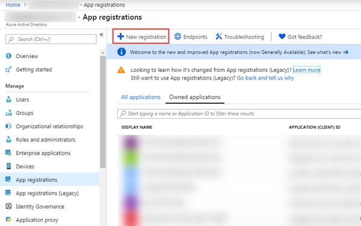

1. Use the following values to create a new Azure AD application and select **Create**:

    - **Name**: Graph Data Connect Data Transfer
    - **Application type**: Web app / API
    - **Sign-on URL**: https://[tenantid].onmicrosoft.com/GraphDataConnectDataTransfer

1. After creating the application, select it.
1. Locate the **Application ID** and copy it as you will need it later in this lab. This will be referred to as the *service principal ID*.
1. Select the **Settings** button from the top navigation.
1. Select the **Keys** menu item from the application's menu:

    

1. In the **Passwords** section, create a new key by entering a **name**, **duration** and **value** and click **Save**.

    It does not matter what you choose, but ensure you keep a copy of the name and the hashed key after it is saved as the hashed value will never be shown again and you will need to create a new key as it is needed later in the lab.

    

    This will be referenced as the *service principal key*.

1. Using the sidebar navigation for the application, select **Owners**.
1. Ensure your account is listed as an owner for the application. If it isn't listed as an owner, add it.
1. While you are in the Azure Active Directory within the Azure portal, obtain the Azure AD's tenant ID as you will need that later in the lab:
    1. From the Azure AD main sidebar navigation, select the **Properties** menu item.
    1. Copy the GUID for the **Directory ID** as you will need this later.

    

### Create Azure Storage Blob

In this step you will create an Azure Storage account where Graph Data Connect will store the data extracted from Office 365 for further processing.

1. Open a browser and navigate to your Azure Portal at [https://portal.azure.com](https://portal.azure.com)
1. Login using an account with global administrator rights to your Azure and Office 365 tenants.
1. Select **Create a resource** from the sidebar navigation.
1. Find the **Storage Account** resource type and use the following values to create it, then select **Review + create**:
    - **Subscription**: *select your Azure subscription*
    - **Resource group**: GraphDataConnect (*or select an existing resource group*)
    - **Storage account name**: [tenantid]gdcdump
        > The tenant ID is used as part of the storage account name because it needs to be globally unique.
    - **Location**: *pick an Azure region near you*
    - **Performance**: Standard
    - **Account kind**: StorageV2 (general purpose v2)
    - **Replication**: Read-access geo-redundant storage (RA-GRS)
    - **Access tier**: Hot
1. Review that the settings match those shown in the previous step and select **Create**    
1. Once the Azure Storage account has been created, grant the Azure AD application previously created the proper access to it.
    1. Select the Azure Storage account
    1. In the sidebar menu, select **Access control (IAM)**

      

    1. Select the **Add role assignment** button in the navigation.
    1. Use the following values to find the application you previously selected to grant it the **Storage Blob Data Contributor** role, then select **Save**:

        - **Role**: Storage Blob Data Contributor
        - **Assign access to**: Azure AD user, group or service principal
        - **Select**: Graph Data Connect Data Transfer (*the name of the Azure AD application you created previously*)
1. Create a new container in the Azure Storage account
    1. Select the Azure Storage account
    1. In the sidebar menu, select **Blobs**
    1. Select the **+Container** button at the top of the page and use the following values and then select **OK**:
        - **Name**: maildump
        - **Public access level**: Private (no anonymous access)

### Create an Azure Data Factory Pipeline

The next step is to use the Azure Data Factory to create a pipeline to extract the data from Office 365 to the Azure Storage account using Graph Data Connect.

1. Open a browser and navigate to your Azure Portal at [https://portal.azure.com](https://portal.azure.com)
1. Login using an account with global administrator rights to your Azure and Office 365 tenants.

    > NOTE: Keep track of the user you are using in this step as you will need to switch to the other user you granted the *global administrator* role and that has *multi-factory authentication* enabled on their account in a later step.

1. Select **Create resource** from the sidebar navigation.
1. Find the **Data Factory** resource type and use the following values to create it, then select **Create**:

    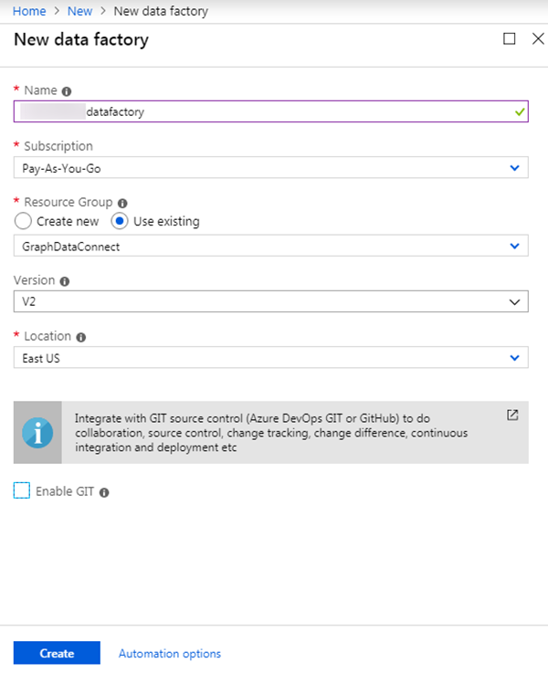

1. Use the following values to create a new Azure Data Factory resource, then select **Create**:

    - **Name**: *create a unique name*
    - **Subscription**: *select your Azure subscription*
    - **Resource group**: *create / select an existing resource group*
    - **Version**: V2
    - **Location**: *pick an Azure region near you*

1. Once the Azure Data Factory resource is created, select the **Author & Monitor** tile to launch the Azure Data Factory full screen editor.

    

1. Switch from the **Overview** to the **Author** experience by selecting it from the left-hand navigation:

    

1. Create a new pipeline by selecting the plus icon, then **pipeline**:

    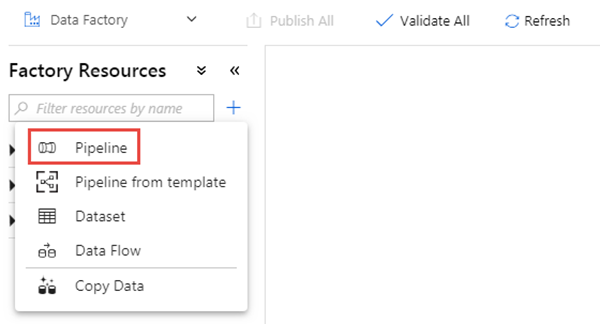

    1. Drag the **Copy Data** activity from the **Move & Transform** section onto the design surface:

        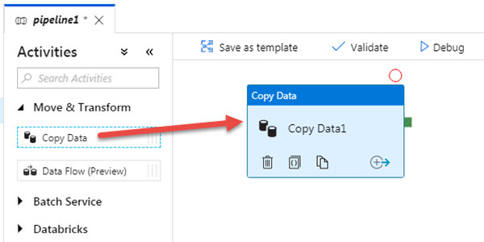

    1. Select the activity in the designer.
    1. In the activity editor pane below the designer, select the **Source** tab, then select **New**.
    1. Locate the dataset **Office 365**, select it and then select the **Finish** button.

        > NOTE: The feature flag you added to the URL earlier is what makes the **Office 365** connector appear in this step. This is only necessary when Graph Data Connect is in preview.

    1. The designer will create a new tab for the Office 365 connector. Select the **Connection** tab in the connector's editor, then the **New** button.
    1. In the dialog that appears, enter the previously created Azure AD application's **Application ID** and **Password** in the **Service principal ID** & **Service principal key** fields, then select **Finish**.

        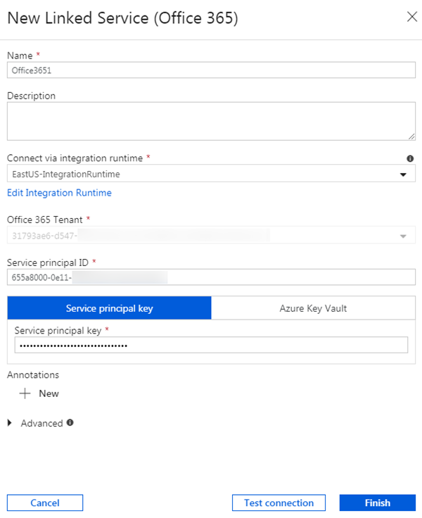

    1. After creating the Office 365 connection, for the **Table** field, select **BasicDataSet_v0.Message_v0**.

        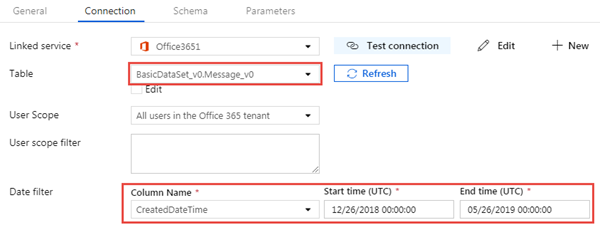

    1. Select the **Schema** tab and then select **Import Schema**.
    1. With the *source* configured for your **copy data** activity, now configure the *sink*, or the location where data will be stored.

        Select the tab in the designer for your pipeline.

    1. Select the **copy data** activity, then select the **sink** tab:

        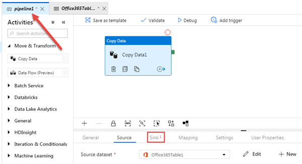

    1. Select the **New** button, then select **Azure Blob Storage**
        1. Select the **Connection** tab.
        1. Set the following values in the dialog, then select **Finish**:
            - **Authentication method**: Service principal
            - **Service endpoint**: https://[REPLACE-AZSTORAGE-ACCOUNT].blob.core.windows.net/
              - *replace `[REPLACE-AZSTORAGE-ACCOUNT]` with the storage account you previously created*
            - **Tenant**: *enter the ID of your Azure tenant*
            - **Service principal ID**: *enter the ID of the Azure AD application you previously created*
            - **Service principal key**: *enter the hashed key of the Azure AD application you previously created*

            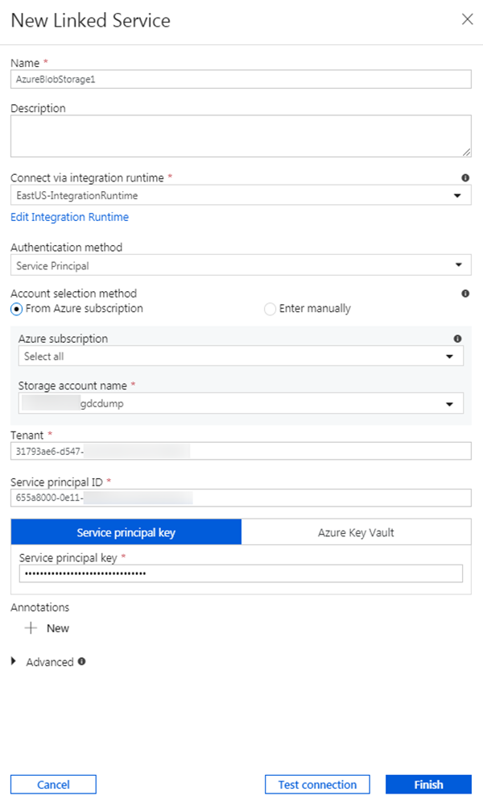

        1. Next to the **File path** field, select **Browse**.
        1. Select the name of the storage container you created previously.
        1. Set the **File format** to **JSON format**.
        1. Set the **File pattern** to **Set of objects**.

            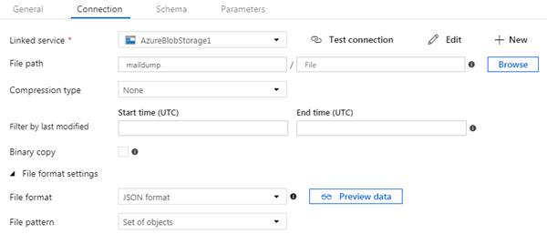

1. With the pipeline created, select the **Validate All** button at the top of the designer.
1. After validating (*and fixing any issues that were found*), select the **Publish All** button at the top of the designer.

### Execute the Azure Data Factory Pipeline

With the pipeline created, now it's time to execute it.

> NOTE: In the current Preview state, some of the tasks in this section can take a while to appear. Such as the request for consent may take 5-30 minutes for the consent request to appear and it is not uncommon for the entire process (start, requesting consent & after approving the consent completing the pipeline run) to take over 40 minutes.

1. In the Azure Data Factory designer, with the pipeline open, select **Trigger > Trigger Now**:

    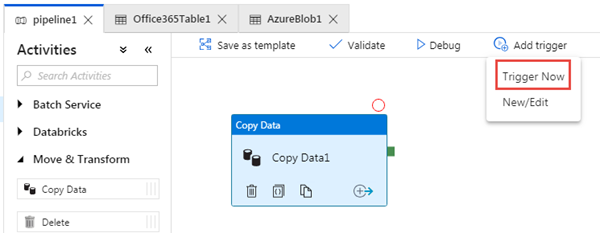

1. After starting the job, from the sidebar menu, select **Monitor** to view current running jobs:

    

1. Locate the pipeline run you just started in the list. In the **Actions** column, select the **View Activity Runs** icon:

    

1. On the **Activity Runs** screen, you will see a list of all the activities that are running in this pipeline. Our pipeline only  has one activity that should show as currently *In Progress*.

    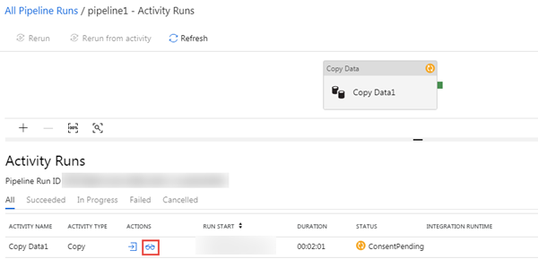

    While the status may show as *In Progress*, the request may be paused internally as the request for access to the data in Office 365 may need to be approved. You can see if this is the case by selecting the **Details** icon in the **Actions** column.

1. In the **Details** screen, look for the status of the pipeline activity as highlighted in the following image. In this case you can see it is in a state of **RequestingConsent**:

    

    At this point, the activity run is internally paused until someone manually approves the consent request.

### Approve Office 365 Consent Request - via Microsoft 365 Admin Center

> NOTE: You can alternatively approve consent requests using Windows PowerShell which is demonstrated in the next section.

1. Open a browser and navigate to your Microsoft 365 Admin Portal at [https://admin.microsoft.com](https://admin.microsoft.com)
1. Replace the URL in the browser with the following link and select <kbd>ENTER</kbd>: https://portal.office.com/adminportal/home#/Settings/PrivilegedAccess
1. Select a pending **Data Access Request**.
1. In the **Data Access Request** callout, select the **Approve** button.

    

### Approve Office 365 Consent Request - via Windows PowerShell

> NOTE: if you approved the request using the Microsoft 365 Admin Center, you can skip this section.

In this step you will use Exchange Online PowerShell to find data requests that are pending consent and approve them so the Azure Data Factory pipeline(s) can continue.

1. Open Windows PowerShell.
1. Ensure your PowerShell session has enabled remotely signed scripts:

    ```powershell
    Set-ExecutionPolicy RemoteSigned
    ```

1. Connect to Exchange Online:
    1. Obtain a login credential by executing the following PowerShell. Login using a different user than one that created & started the Azure Data Factory pipeline, who has the **global administrator** role applied, who is a member of the group that has rights to approve requests to data in Office 365, and has multi-factor authentication enabled:

        ```powershell
        $UserCredential = Get-Credential
        ```

    1. Create a new Exchange Online PowerShell session & load (import) it:

        ```powershell
        $Session = New-PSSession -ConfigurationName Microsoft.Exchange -ConnectionUri https://ps.protection.outlook.com/powershell-liveid/ -Credential $UserCredential -Authentication Basic -AllowRedirection
        Import-PSSession $Session -DisableNameChecking
        ```

        > NOTE: Once you are finished with this session, be sure you you disconnect from the session using the PowerShell command `Remove-PSSession $Session`. Exchange Online only allows for three open remote PowerShell sessions to protect against denial-of-service (DoS) attacks.
        >
        > If you simply close the PowerShell window, it will leave the connection open.

1. Get a list of all pending data requests from Graph Data Connect by executing the following PowerShell:

    ```powershell
    Get-ElevatedAccessRequest | where {$_.RequestStatus -eq 'Pending'} | select RequestorUPN, Service, Identity, RequestedAccess | fl
    ```

    Examine the list of data access requests returned. In the following image, notice there are two pending requests:

    

1. Approve a data access returned in the previous step by copying the **Identity** GUID of a request by executing the following PowerShell:

    > NOTE: Replace the GUID in the following code snippet with the GUID from the results of the previous step.

    ```powershell
    Approve-ElevatedAccessRequest -RequestId fa041379-0000-0000-0000-7cd5691484bd -Comment 'approval request granted'
    ```

1. After a few moments, you should see the status page for the activity run update to show it is now extracting data:

    

This process of extracting the data can take some time depending on the size of your Office 365 tenant as shown in the following examples:


### Verify data extracted from Office 365 to Azure Storage Blob

Once the pipeline completes, verify data has been extracted to the Azure Storage Blob.

1. Open a browser and navigate to your Azure Portal at [https://portal.azure.com](https://portal.azure.com).
1. Login using an account with global administrator rights to your Azure and Office 365 tenants.
1. Select the **All resources** menu item from the sidebar navigation.
1. In the list of resources, select the Azure Storage account you created previously in this lab.
1. On the Azure Storage account blade, select **Blobs** from the sidebar menu.
1. Select the container created previously in this lab that you configured the Azure Data Factory pipeline as the sink for the extracted data. You should see data in this container now:

    
